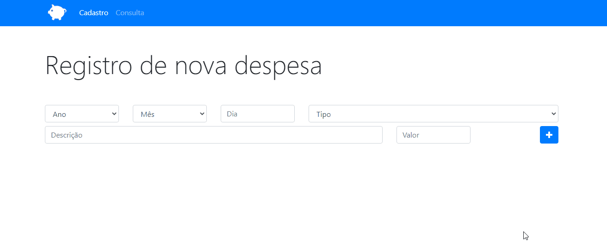
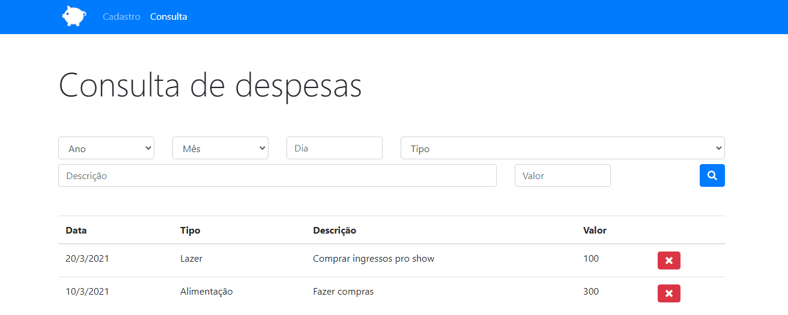

 

    <h1>App Orçamento Pessoal</h1>

 

## 📕 About

The Personal Budget app aims to organize the user's day-to-day expenses during storing the data on localStorage making the history of previous months to be kept for a consultation.
  

## 💻 Preview

    
      
    

  

## 🔨 Tools

- HTML
- CSS
- JavaScript
- LocalStorage
  

## 🙋🏽‍♂️ Author

### Enzo Alexsander